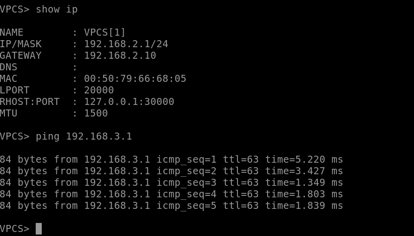
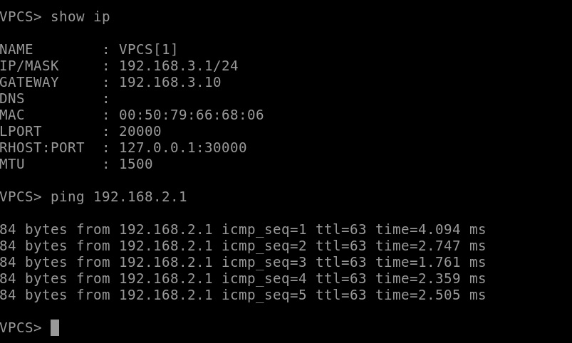
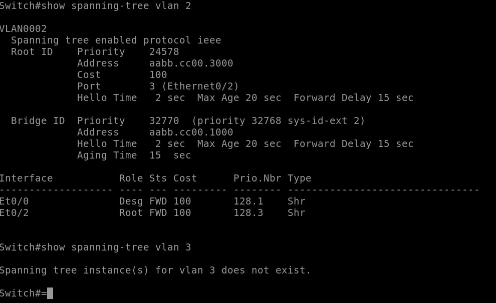
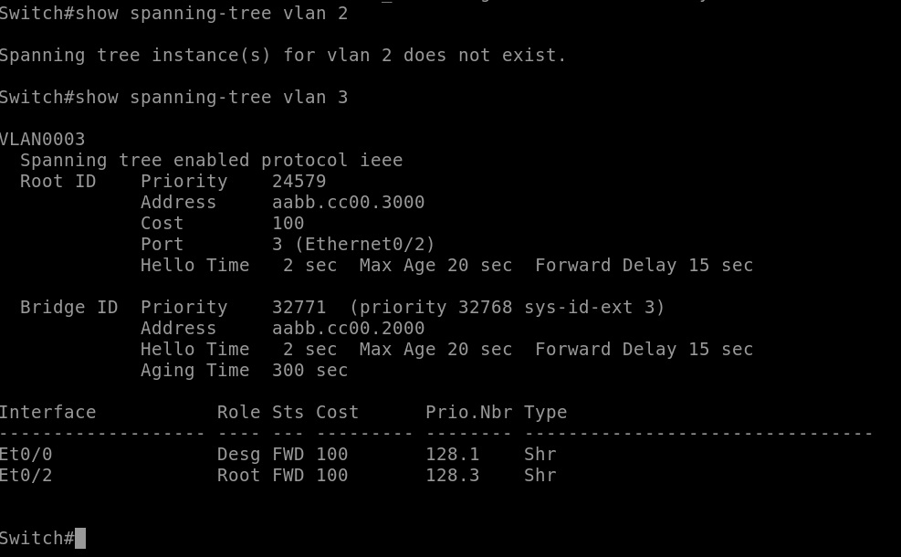
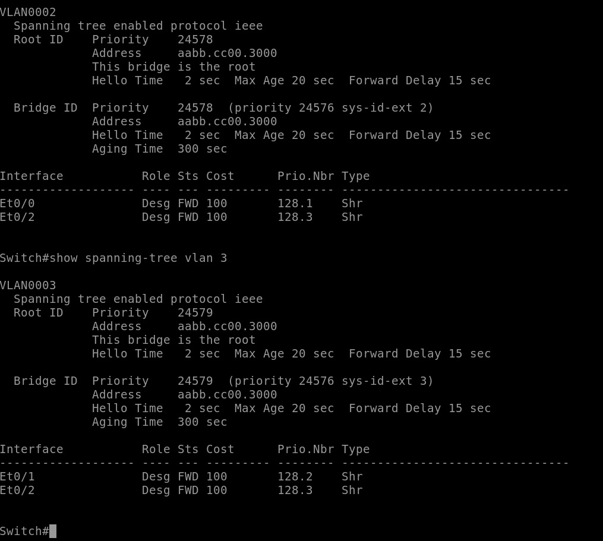

# ДЗ-1

Пингуем виртуальные машины:

На свитчах смотрим, что виртуальные таблицы те, которые нужно:

Последняя картинка - коммутатор уровня распределения - корень в обеих виртуальных подсетях

PS: при попытке закоммитить git выдал:

warning: LF will be replaced by CRLF in hw1/HW-1.unl.
The file will have its original line endings in your working directory

Я откатил изменения через reset и убрал автозаполнение, но оно могло остаться.
Пожалуйста, дайте знать, если так случилось и вследствие конфиг из домашней работы не открывается