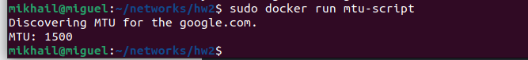
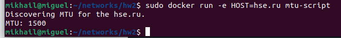

# ДЗ-2

Заходим в директорию со скриптом. Билдим скрипт:

sudo docker-compose build mtu-script

Затем запускаем скрипт. Если запустить без аргументов, то скрипт фоллбэкнется на google.com:

sudo docker run mtu-script

Или можем ввести аргумент как переменную окружения в докере и скрипт будет искать MTU на пути к аргументу:

sudo docker run -e HOST=hse.ru mtu-script

