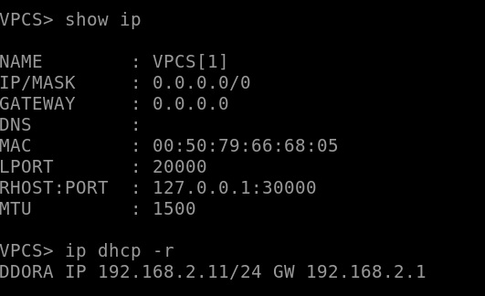
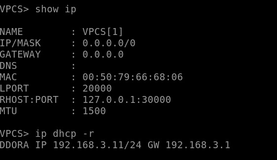
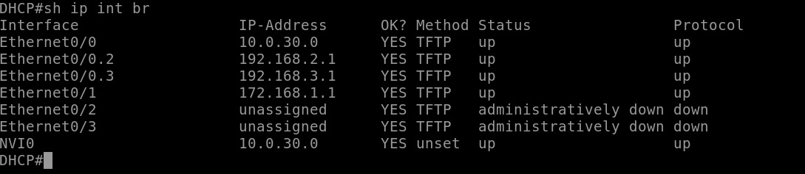
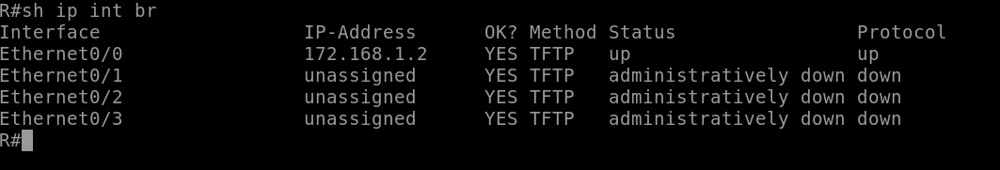
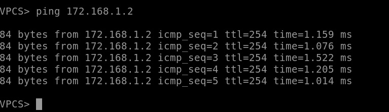
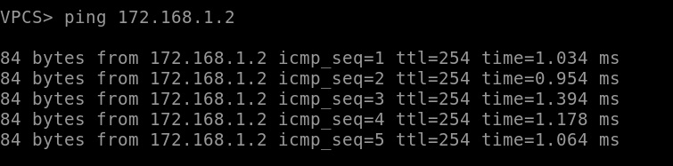
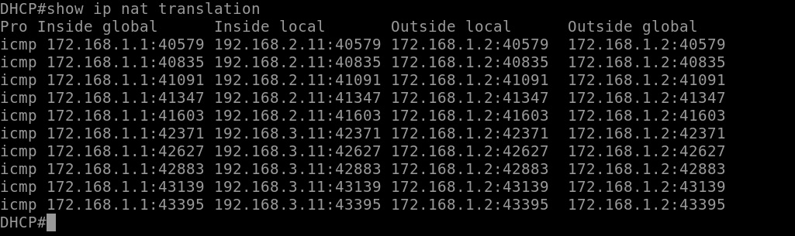

# ДЗ-3

Получаем айпишники от dhcp-сервера:

Смотрим конфигурации роутеров:

Тот, на котором настроена NAT и который DHCP-сервер:

Второй:

Пингуем удалённый роутер с обоих машин, из разных подсетей:

Смотрим таблицу nat translation:

