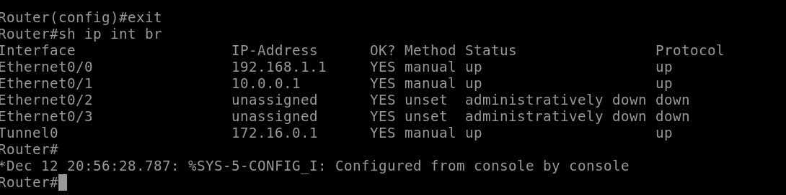
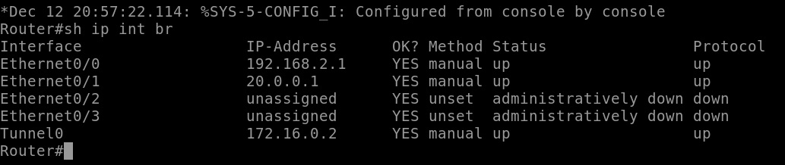
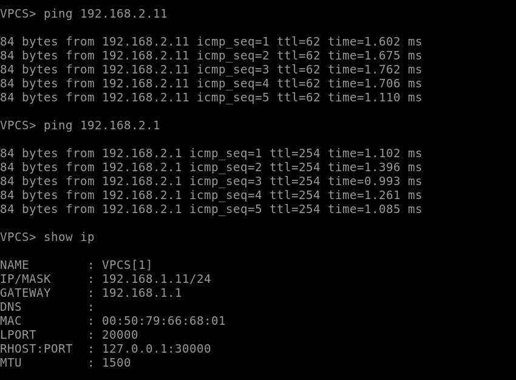
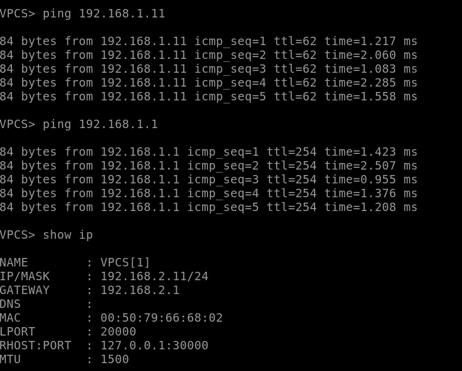
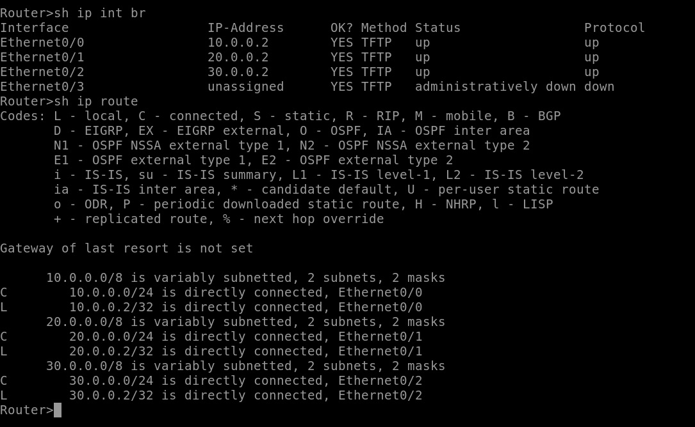

# ДЗ-4

Cмотрим, что на роутерах настроен туннель:

Пингуем устройства из разных сетей:

Убеждаемся, что центральный роутер ничего не знает про другие сети (только про те, что подключены напрямую):

